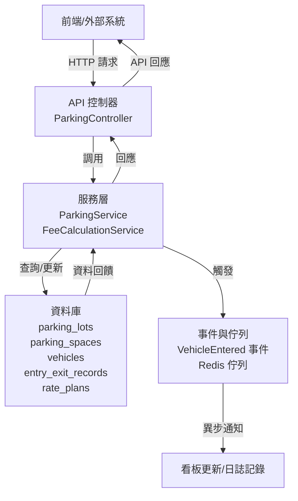

# 停車管理系統 (Parking Management System)

這是一個簡單的停車管理系統，功能包含車輛進出記錄、費用計算和基本用戶管理。專案用 Laravel 寫的，結構模組化，方便維護和擴展。這個倉庫只放核心代碼，Laravel 基本框架得自己裝。以下是重點介紹，想知道細節就直接看程式碼或試著跑跑看。

## 系統架構
系統分成三個主要模組：
- **Parking**：處理車輛進出、車位分配，確保高流量下不出錯。
- **Billing**：計算停車費用，支援不同費率規則。
- **User**：管理用戶和角色（像管理員或保全）。

架構圖（用 Mermaid 畫，GitHub 上能直接顯示）：


## 環境需求
- PHP >= 8.2
- Composer
- MySQL 或其他 Laravel 支援的資料庫
- Redis（可選，用來做快取或佇列）

## 安裝步驟
1. 複製專案：`git clone https://github.com/BpsEason/parking-management-system-full.git`
2. 初始化 Laravel 專案：用 `composer create-project laravel/laravel parking-management-system` 建一個新專案。
3. 複製核心代碼：把倉庫裡的 `app/Modules` 和 `routes/api.php` 丟到你的 Laravel 專案對應目錄。
4. 安裝依賴：跑 `composer install`
5. 複製環境檔案：跑 `cp .env.example .env`
6. 設定 `.env`（資料庫、Redis 之類的）
7. 生成應用金鑰：跑 `php artisan key:generate`
8. 執行遷移：跑 `php artisan migrate`
9. 啟動伺服器：跑 `php artisan serve`
10. （可選）啟動佇列工作：跑 `php artisan queue:work redis --tries=3 --timeout=90`

## 專案亮點
- **模組化設計**：把停車、計費、用戶管理分成獨立模組，程式碼清楚，維護方便。
- **高並發安全**：車位分配用資料庫事務和悲觀鎖，確保不會把同一個車位分給多輛車。
- **靈活費率系統**：用策略模式，支援時租、日租、月租，未來加新規則很簡單。
- **事件驅動架構**：車輛進出觸發事件，異步處理看板更新或費用計算，效率高且即時。
- **異常處理完善**：自訂異常（像無車位、找不到記錄），搭配統一 API 回應，方便前端整合。
- **測試基礎**：有單元測試和功能測試骨架，方便用 TDD 或驗證核心邏輯。

## 核心功能與代碼
以下是系統的核心功能和代碼，已經加了詳細註解，完整內容請看倉庫檔案。

### 1. 車輛進出記錄
負責記錄車輛進出，確保車位分配不出錯，用悲觀鎖處理高並發問題。

**ParkingService.php**
```php
<?php

namespace App\Modules\Parking\Services;

use App\Modules\Parking\Models\Vehicle;
use App\Modules\Parking\Models\ParkingSpace;
use App\Modules\Parking\Models\EntryExitRecord;
use App\Exceptions\NoAvailableSpaceException;
use Illuminate\Support\Facades\DB;

class ParkingService
{
    /**
     * 記錄車輛進場
     * @param string $licensePlate 車牌號碼
     * @param int $parkingLotId 停車場 ID
     * @return EntryExitRecord 進場記錄
     * @throws NoAvailableSpaceException 若無可用車位
     */
    public function recordVehicleEntry(string $licensePlate, int $parkingLotId): EntryExitRecord
    {
        // 用資料庫事務確保操作原子性
        return DB::transaction(function () use ($licensePlate, $parkingLotId) {
            // 檢查或創建車輛記錄，確保車輛存在
            $vehicle = Vehicle::firstOrCreate([
                'license_plate_number' => $licensePlate,
                'parking_lot_id' => $parkingLotId
            ]);

            // 查可用車位，用悲觀鎖避免並發衝突
            $availableSpace = ParkingSpace::where('parking_lot_id', $parkingLotId)
                                          ->where('status', 'available')
                                          ->lockForUpdate()
                                          ->first();
            
            // 沒車位就丟異常
            if (!$availableSpace) {
                throw new NoAvailableSpaceException("No available spaces found in parking lot ID: {$parkingLotId}");
            }

            // 更新車位狀態為已占用
            $availableSpace->update(['status' => 'occupied']);

            // 創建進場記錄
            $record = EntryExitRecord::create([
                'parking_lot_id' => $parkingLotId,
                'vehicle_id' => $vehicle->id,
                'parking_space_id' => $availableSpace->id,
                'entry_time' => now(),
            ]);

            // 觸發進場事件，給異步處理（像更新看板）
            event(new \App\Modules\Parking\Events\VehicleEntered($record));

            return $record;
        });
    }
}
```

### 2. 費用計算
根據費率規則算停車費，支援策略模式，方便加新計費方式。

**FeeCalculationService.php**
```php
<?php

namespace App\Modules\Billing\Services;

use App\Modules\Parking\Models\EntryExitRecord;
use App\Modules\Billing\Models\RatePlan;

class FeeCalculationService
{
    /**
     * 計算停車費用
     * @param EntryExitRecord $record 進出記錄
     * @return float 計算出的費用
     * @throws \Exception 若無有效費率方案
     */
    public function calculateFee(EntryExitRecord $record): float
    {
        // 查停車場的活躍費率方案
        $ratePlan = RatePlan::where('parking_lot_id', $record->parking_lot_id)
                            ->where('is_active', true)
                            ->first();
        
        // 沒費率方案就丟異常
        if (!$ratePlan) {
            throw new \Exception("No active rate plan found for parking lot ID: {$record->parking_lot_id}");
        }

        // 算停車時長（小時）
        $durationInHours = $record->exit_time->diffInHours($record->entry_time);

        // 從費率方案的 JSON 拿每小時費率，預設 40
        $hourlyRate = $ratePlan->rules['hourly_rate'] ?? 40;

        // 算總費用
        return $durationInHours * $hourlyRate;
    }
}
```

### 3. API 端點
提供車輛進出和費用查詢的 RESTful API，簡單好整合。

**api.php**
```php
<?php

use App\Http\Controllers\Api\V1\ParkingController;

use Illuminate\Support\Facades\Route;

/*
|--------------------------------------------------------------------------
| API Routes
|--------------------------------------------------------------------------
|
| 定義停車管理系統的 API 路由，均位於 /api/v1 前綴下
|
*/

Route::prefix('v1')->group(function () {
    // 需要認證的路由，用 Sanctum 中間件
    Route::middleware('auth:sanctum')->group(function () {
        // 車輛進場 API
        Route::post('parking/entry', [ParkingController::class, 'entry']);
        // 車輛出場 API
        Route::post('parking/exit', [ParkingController::class, 'exit']);
    });
});
```

## 資料庫結構
核心資料表：
- `parking_lots`：停車場資訊（名稱、地址、總車位數）。
- `parking_spaces`：車位資訊（編號、類型、狀態）。
- `vehicles`：車輛資訊（車牌、所屬停車場）。
- `entry_exit_records`：進出記錄（車輛、車位、時間、費用）。
- `rate_plans`：費率方案（規則用 JSON 存）。
- `users` 和 `roles`：用戶和角色管理。

**注意**：資料庫遷移檔案得自己照 Laravel 標準流程寫，參考模型結構就好。

## 測試
專案有單元測試和功能測試骨架，放在 `tests/Unit` 和 `tests/Feature`。跑測試：
```bash
php artisan test
```

**注意**：測試檔案得自己依 Laravel 測試框架補齊。

## 常見問題與解答 (FAQ)

### 1. 架構與設計模式
**為什麼用模組化架構，而不是傳統 MVC？有啥優缺點？**  
這專案把停車、計費、用戶管理分成獨立模組，程式碼按業務分清楚，符合「高內聚、低耦合」。好處是職責分明，團隊分工方便，未來加功能也簡單。缺點是架構比傳統 MVC 複雜點，得多花心思設路由、服務提供者和命名空間。

**ParkingService 為啥用 DB::transaction 和 lockForUpdate()？不用的話會怎樣？**  
DB::transaction 確保資料庫操作要嘛全成功，要嘛全失敗，像是車位狀態更新和進場記錄得一起完成。lockForUpdate() 是悲觀鎖，查車位時鎖住資料，避免多個請求搶同一個車位。如果沒這兩個，高流量時可能會把同一個車位分給多輛車，亂掉。

**計費模組用策略模式算費率，怎麼實現的？為啥不用 if/else？**  
策略模式把時租、日租等計費邏輯封裝成獨立類別，透過 RateCalculationStrategyInterface 統一規範。FeeCalculationService 根據 rate_plan 動態選策略。比起 if/else，這樣未來加新費率只要寫新類別，不用改核心程式碼，符合開閉原則。

**為啥用事件驅動架構，車輛出場觸發 VehicleExited 事件，而不是直接在 recordVehicleExit 算費用？**  
事件驅動讓費用計算、看板更新這些耗時操作可以異步跑，放進佇列，縮短 API 回應時間，使用者體驗更好。即使費用算錯，也不會卡住出場流程。想加日誌或通知，新增監聽器就行，擴展性高。

### 2. 程式碼細節與實務
**ParkingService::recordVehicleEntry 用 Vehicle::firstOrCreate，會跑幾次資料庫查詢？車輛已存在時有啥效能問題？**  
firstOrCreate 先跑一次 SELECT 查車輛，不存在就再跑一次 INSERT，最多兩次。如果車輛已存在，只跑一次 SELECT。效能上，若進場頻率高，建議快取常用車輛資料，或用原生 SQL 少跑點查詢。

**API 路由用 Route::middleware('auth:sanctum')，Sanctum 怎麼運作？為啥適合這專案？**  
Sanctum 是輕量級 API 認證，適合行動 App 或 SPA。使用者登入後，伺服器給個 token，後續請求帶著這 token 在 Header 驗證。比 OAuth2 簡單，設定省事，很適合這種輕量級 API。

**為啥自訂 NoAvailableSpaceException 和 RecordNotFoundException，在 Handler.php 處理？有啥好處？**  
自訂異常讓錯誤原因一目了然。統一在 Handler.php 處理，業務邏輯和錯誤處理分開，控制器不用寫一堆 try-catch，還能回統一的 API 錯誤格式，前端整合起來方便。

**EntryExitRecord 的 exit_time 和 total_fee 為啥設可空？業務上代表啥？**  
exit_time 和 total_fee 可空是因為車輛進場時還沒出場，這兩個欄位沒值，只有出場時才會填。這符合實際流程，也方便查「還沒出場的車」（whereNull('exit_time')）。

### 3. 效能與部署
**預設用 Redis 做快取和佇列，沒 Redis 會不會掛？有啥建議？**  
沒 Redis 又沒改配置，佇列或快取可能會出錯。建議在 `.env` 把 `CACHE_DRIVER` 改成 `file`，`QUEUE_CONNECTION` 改成 `sync` 或 `database`，這樣就能不靠 Redis 跑起來。

**如果車位數有幾萬個，ParkingSpace 查 where('status', 'available') 會不會慢？怎麼優化？**  
查 status = 'available' 若沒索引，可能掃全表，很吃效能。建議在 `status` 欄位加索引（`CREATE INDEX idx_status ON parking_spaces(status)`）。另外，可以用 Redis 存可用車位數，進出場時更新，少查資料庫。

**用了悲觀鎖，部署時怎麼確保資料庫交易隔離和鎖定沒問題？**  
得用支援行級鎖的引擎，像 MySQL 的 InnoDB。預設隔離級別（REPEATABLE READ）通常夠用。部署時，檢查 `my.cnf` 確認 InnoDB 正常，別被怪配置搞亂。

### 4. 測試與維護
**ParkingServiceTest.php 用 Mockery 模擬依賴，為啥要這樣？**  
單元測試要專注測單一模組。Mockery 模擬 ParkingRecordRepositoryInterface，隔離資料庫，測試跑得快，還能確保只測 ParkingService 的邏輯，不被外部影響。

**README 提到未來改進「補充 Seeder」和「角色權限檢查」，具體怎麼做？**  
- **Seeder**：寫 `ParkingLotSeeder`、`ParkingSpaceSeeder`、`RoleSeeder` 和 `UserSeeder`，在 `DatabaseSeeder` 串起來，跑 `php artisan migrate --seed` 就能快速填測試資料，方便開發。  
- **角色權限檢查**：在 `VehicleEntryRequest` 的 `authorize()` 用 `Auth::user()->hasRole('security')` 檢查角色，再用 Laravel Policy（像 `ParkingPolicy`）定義細部權限，在 `ParkingController` 呼叫 `$this->authorize('create', EntryExitRecord::class)`，權限邏輯集中好管理。

## 注意事項
- 倉庫只給核心代碼，Laravel 基本框架（像 `config`、`public`）得自己裝。
- 預設用 Redis 做快取和佇列，沒 Redis 就在 `.env` 改用 `file` 或 `sync`。
- 費率目前是簡單時租，實際用可加日租或階梯費率。
- API 用 Sanctum 認證，建議依需求設權限檢查。
- 沒給 Seeder，建議自己加，方便生測試資料。

## 未來改進
- 加資料庫 Seeder，快速生成測試資料。
- 做 OpenAPI 文件，讓 API 更好用。
- 加上角色權限檢查（像只有保全能記錄進出）。
- 支援多語言，方便國際化。

有問題直接在 GitHub 開 issue 或聯繫開發者，謝謝！
