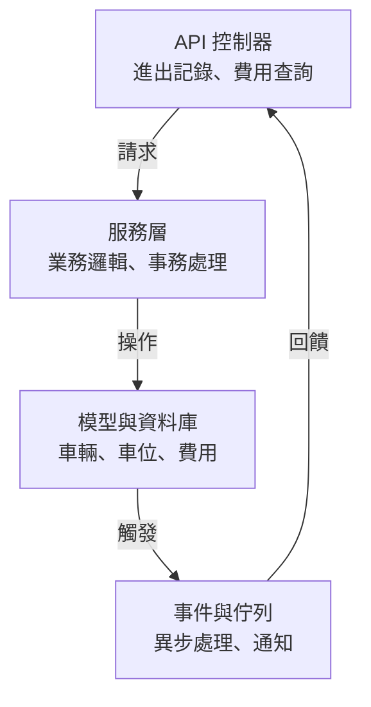

# 停車管理系統 (Parking Management System)

這是一個簡單的停車管理系統，功能包含車輛進出記錄、費用計算和基本用戶管理。專案使用 Laravel 開發，結構模組化，方便維護和擴展。本倉庫僅包含核心代碼，Laravel 基本框架需自行安裝。以下是核心介紹，細節請直接看程式碼或部署試試。

## 系統架構
系統分成三個主要模組：
- **Parking**：處理車輛進出、車位分配，確保高並發安全。
- **Billing**：計算停車費用，支援靈活的費率規則。
- **User**：管理用戶和角色（如管理員、安全人員）。

架構圖（使用 Mermaid 繪製，GitHub 可直接渲染）：


## 環境需求
- PHP >= 8.2
- Composer
- MySQL 或其他 Laravel 支援的資料庫
- Redis（可選，作為快取或佇列驅動）

## 安裝步驟
1. 複製專案：`git clone https://github.com/BpsEason/parking-management-system-full.git`
2. 初始化 Laravel 專案：在本地創建一個新的 Laravel 專案（`composer create-project laravel/laravel parking-management-system`）。
3. 複製核心代碼：將倉庫中的 `app/Modules` 和 `routes/api.php` 複製到你的 Laravel 專案對應目錄。
4. 安裝依賴：`composer install`
5. 複製環境檔案：`cp .env.example .env`
6. 設定 `.env`（資料庫、Redis 等）
7. 生成應用金鑰：`php artisan key:generate`
8. 執行遷移：`php artisan migrate`
9. 啟動伺服器：`php artisan serve`
10. （可選）啟動佇列工作進程：`php artisan queue:work redis --tries=3 --timeout=90`

## 專案亮點
- **模組化設計**：將停車、計費、用戶管理分模組，程式碼清晰，易於維護和擴展。
- **高並發安全**：車位分配使用資料庫事務和悲觀鎖，確保高流量下不重複分配車位。
- **靈活費率系統**：採用策略模式，支援時租、日租、月租等多種計費方式，未來可輕鬆新增規則。
- **事件驅動架構**：車輛進出觸發事件，異步更新看板和計算費用，提升效能和即時性。
- **異常處理完善**：自定義異常（如無可用車位、記錄未找到），搭配統一的 API 回應格式，方便前端整合。
- **測試基礎**：提供單元測試和功能測試骨架，方便開發者進行 TDD 或驗證核心邏輯。

## 核心功能與代碼
以下是系統的關鍵功能和對應的核心代碼，已添加詳細註解，完整實現請參考倉庫檔案。

### 1. 車輛進出記錄
記錄車輛進出，並確保車位分配不衝突，使用悲觀鎖避免並發問題。

**ParkingService.php**
```php
<?php

namespace App\Modules\Parking\Services;

use App\Modules\Parking\Models\Vehicle;
use App\Modules\Parking\Models\ParkingSpace;
use App\Modules\Parking\Models\EntryExitRecord;
use App\Exceptions\NoAvailableSpaceException;
use Illuminate\Support\Facades\DB;

class ParkingService
{
    /**
     * 記錄車輛進場
     * @param string $licensePlate 車牌號碼
     * @param int $parkingLotId 停車場 ID
     * @return EntryExitRecord 進場記錄
     * @throws NoAvailableSpaceException 若無可用車位
     */
    public function recordVehicleEntry(string $licensePlate, int $parkingLotId): EntryExitRecord
    {
        // 使用資料庫事務確保操作原子性
        return DB::transaction(function () use ($licensePlate, $parkingLotId) {
            // 檢查或創建車輛記錄，確保車輛存在
            $vehicle = Vehicle::firstOrCreate([
                'license_plate_number' => $licensePlate,
                'parking_lot_id' => $parkingLotId
            ]);

            // 查詢可用車位，並使用悲觀鎖防止並發衝突
            $availableSpace = ParkingSpace::where('parking_lot_id', $parkingLotId)
                                          ->where('status', 'available')
                                          ->lockForUpdate()
                                          ->first();
            
            // 若無可用車位，拋出異常
            if (!$availableSpace) {
                throw new NoAvailableSpaceException("No available spaces found in parking lot ID: {$parkingLotId}");
            }

            // 更新車位狀態為已占用
            $availableSpace->update(['status' => 'occupied']);

            // 創建進場記錄
            $record = EntryExitRecord::create([
                'parking_lot_id' => $parkingLotId,
                'vehicle_id' => $vehicle->id,
                'parking_space_id' => $availableSpace->id,
                'entry_time' => now(),
            ]);

            // 觸發車輛進場事件，用於異步處理（如更新看板）
            event(new \App\Modules\Parking\Events\VehicleEntered($record));

            return $record;
        });
    }
}
```

### 2. 費用計算
根據費率規則計算停車費用，支援策略模式，方便未來擴展不同計費方式。

**FeeCalculationService.php**
```php
<?php

namespace App\Modules\Billing\Services;

use App\Modules\Parking\Models\EntryExitRecord;
use App\Modules\Billing\Models\RatePlan;

class FeeCalculationService
{
    /**
     * 計算停車費用
     * @param EntryExitRecord $record 進出記錄
     * @return float 計算出的費用
     * @throws \Exception 若無有效費率方案
     */
    public function calculateFee(EntryExitRecord $record): float
    {
        // 查詢停車場的活躍費率方案
        $ratePlan = RatePlan::where('parking_lot_id', $record->parking_lot_id)
                            ->where('is_active', true)
                            ->first();
        
        // 若無費率方案，拋出異常
        if (!$ratePlan) {
            throw new \Exception("No active rate plan found for parking lot ID: {$record->parking_lot_id}");
        }

        // 計算停車時長（小時）
        $durationInHours = $record->exit_time->diffInHours($record->entry_time);

        // 從費率方案的 JSON 規則中獲取每小時費率，預設 40
        $hourlyRate = $ratePlan->rules['hourly_rate'] ?? 40;

        // 計算總費用
        return $durationInHours * $hourlyRate;
    }
}
```

### 3. API 端點
提供車輛進出和費用查詢的 RESTful API，簡潔且易於整合。

**api.php**
```php
<?php

use App\Http\Controllers\Api\V1\ParkingController;

use Illuminate\Support\Facades\Route;

/*
|--------------------------------------------------------------------------
| API Routes
|--------------------------------------------------------------------------
|
| 定義停車管理系統的 API 路由，均位於 /api/v1 前綴下
|
*/

Route::prefix('v1')->group(function () {
    // 需要認證的路由，使用 Sanctum 中間件
    Route::middleware('auth:sanctum')->group(function () {
        // 車輛進場 API
        Route::post('parking/entry', [ParkingController::class, 'entry']);
        // 車輛出場 API
        Route::post('parking/exit', [ParkingController::class, 'exit']);
    });
});
```

## 資料庫結構
核心資料表：
- `parking_lots`：停車場資訊（名稱、地址、總車位數）。
- `parking_spaces`：車位資訊（編號、類型、狀態）。
- `vehicles`：車輛資訊（車牌、所屬停車場）。
- `entry_exit_records`：進出記錄（車輛、車位、時間、費用）。
- `rate_plans`：費率方案（規則以 JSON 儲存）。
- `users` 和 `roles`：用戶和角色管理。

**注意**：資料庫遷移檔案需自行根據 Laravel 標準流程創建，參考模型結構即可。

## 測試
專案包含單元測試和功能測試骨架，位於 `tests/Unit` 和 `tests/Feature`。執行測試：
```bash
php artisan test
```

**注意**：測試檔案需自行根據 Laravel 測試框架補充。

## 常見問題
1. **Q：如何整合核心代碼到 Laravel 專案？**
   - **A**：先創建一個新的 Laravel 專案，然後將 `app/Modules` 和 `routes/api.php` 複製到對應目錄。確保 `composer.json` 已包含必要依賴，並執行 `composer install`。

2. **Q：執行 `composer install` 時提示 PHP 版本不符？**
   - **A**：確認 PHP 版本 >= 8.2，執行 `php -v` 檢查。若版本過低，可用 Docker 或升級 PHP。

3. **Q：啟動時 Redis 連線失敗？**
   - **A**：確認 Redis 服務是否運行，或在 `.env` 將 `CACHE_DRIVER` 和 `QUEUE_CONNECTION` 改為 `file` 或 `sync`，以跳過 Redis 依賴。

4. **Q：車位分配失敗或重複分配？**
   - **A**：系統使用悲觀鎖避免並發問題，確保資料庫支援鎖定機制（如 MySQL InnoDB）。若仍發生問題，檢查資料庫連線是否穩定。

5. **Q：API 回應 403 或 401 錯誤？**
   - **A**：API 使用 Sanctum 認證，需先透過 `/api/user` 取得 token。請參考 Laravel Sanctum 文件設定認證流程。

6. **Q：費用計算結果不符合預期？**
   - **A**：檢查 `rate_plans` 表的 `rules` 欄位是否正確配置 JSON 格式（如 `{"hourly_rate": 40}`）。可手動新增測試資料驗證。

## 注意事項
- 本倉庫僅包含核心代碼，Laravel 基本框架（如 `config`、`public` 等）需自行安裝。
- 預設使用 Redis 作為快取和佇列驅動，若無 Redis，可在 `.env` 改用 `file` 或 `sync` 驅動。
- 費率規則目前以簡單每小時計費為例，實際應用可擴展為日費、階梯費率等。
- API 預設使用 Sanctum 認證，建議根據需求配置權限檢查。
- 尚未包含 Seeder，建議自行新增以生成測試資料。

## 未來改進
- 補充資料庫 Seeder，方便快速生成測試資料。
- 加入 OpenAPI 文件，提升 API 易用性。
- 實現角色權限檢查（如僅安全人員可記錄進出）。
- 新增多語言支援，提升國際化能力。

有問題請直接在 GitHub 開 issue 或聯繫開發者，謝謝！
